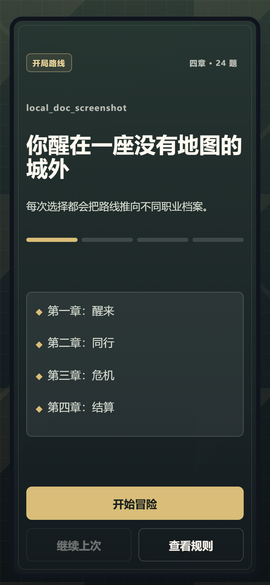
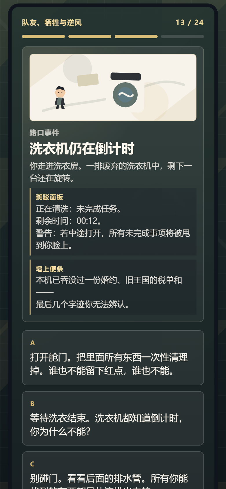
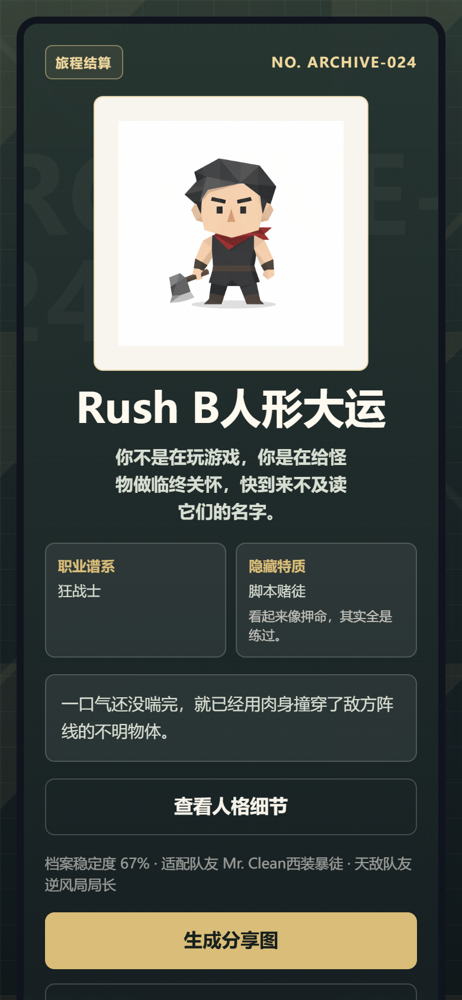
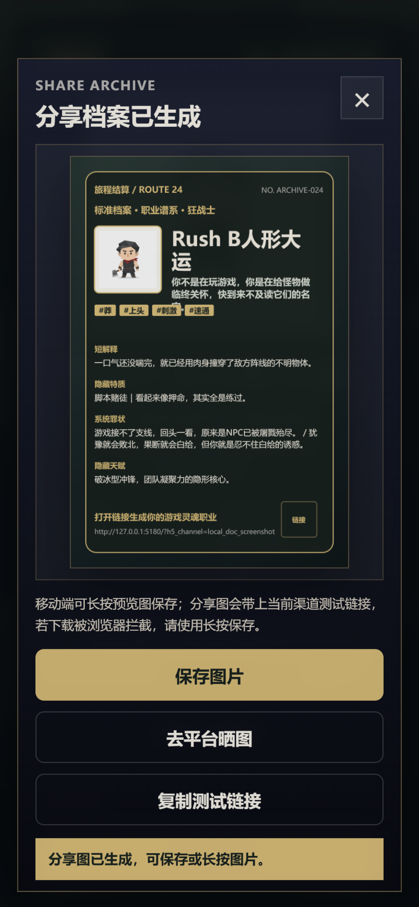
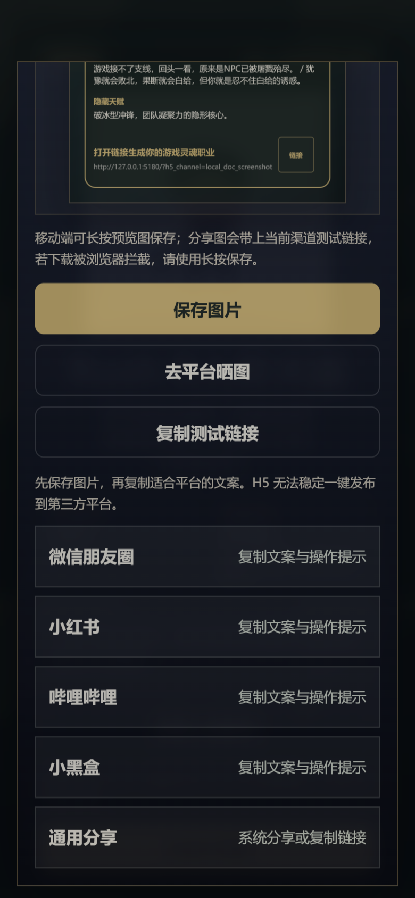
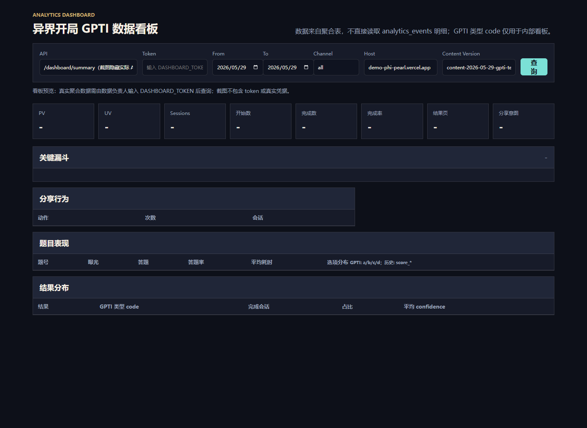

# GPTI-H5 落地方案

日期：2026-05-29  
更新：2026-06-01

当前依据：本地代码、README、DEPLOYMENT、docs 文档、测试结果、本地构建浏览器验证、Vercel 预览入口和 CloudBase 公开接口只读核查。若历史文档与当前代码不一致，以当前代码、README、DEPLOYMENT 和测试结果为准。

## 1. 给组员核对的说明

> 我整理了一版 GPTI-H5 面向的落地方案初稿，重点是“这个 H5 准备怎么发、怎么传播、结果页后怎么承接用户、怎么排期验收”。请大家重点看：入口和发布渠道是否准确、传播文案是否适合、结果页承接路径是否可执行、分工排期有没有漏项、风险是否说清楚。  
> 当前版本已基于最终 16 型人格结果接入结果页细节文案和平台分享文案；未改 CloudBase 配置，未部署。请在群里直接指出需要改的段落。

## 2. 项目现状摘要

GPTI-H5 当前是一套纯静态 H5 测试页，用户通过 24 道选择题完成“异界开局人格测试”，最终生成一个“游戏灵魂职业 / 异界职业档案卡”。当前产品已经具备基础落地条件：可答题、可生成结果、可展示隐藏特质、可生成分享图、可复制分享文案、可带渠道参数回流，并已接入 CloudBase 埋点和内部数据看板。

2026-06-01 结果文案与题目展示更新：项目已接入最终确定的 16 型结果名称、结果页“人格细节”展开内容和各平台分享文案；同时修正 q12/q13 文案，接入 24 题场景插画初版和长题干结构化展示。本次更新不改变 GPTI 16 型主结果体系，不改变隐藏特质的附加展示定位，也不改变 CloudBase rollup/dashboard 统计口径。

当前运行事实：

| 模块 | 当前状态 |
| --- | --- |
| 用户入口 | 当前预览、手机验证、临时试玩入口使用 Vercel 公开别名：`https://demo-phi-pearl.vercel.app` |
| 正式入口 | 等腾讯光核提供已备案正式域名后再作为正式用户入口 |
| CloudBase 默认静态域名 | 仅用于技术排查，不作为用户试玩或正式传播入口；已复现 `content-disposition: attachment` 风险 `https://test1264-d0gzi7ut615711548-1434258997.tcloudbaseapp.com`|
| 内容版本 | `content-2026-06-01-gpti-final-copy-c` |
| 测试结构 | 4 章、24 题、每题 4 个选项 |
| 主结果 | 标准 16 型 GPTI 结果保持不变 |
| 隐藏特质 | 作为附加展示，不覆盖主结果 |
| 分享闭环 | 结果页提供生成分享图、复制分享文案、重新测试；分享弹层提供保存图片、去平台晒图、复制测试链接 |
| 数据链路 | CloudBase 埋点采集、rollup 聚合、内部 dashboard 看板 |
| 当前验证 | Node 测试通过，构建通过，Playwright 已跑通本地构建的结果页、人格细节、分享图和平台文案面板 |

需要强调给导师的是：当前项目已经不是“技术 demo 日志”，而是可以进入小范围落地验证的 H5 case；但正式传播入口、用户承接目的地、是否需要二维码/短链、是否做结果页后续 CTA，还需要团队确认。

### 2.1 实际 H5 体验流程预览

以下截图来自当前本地构建后的真实浏览器流程，截图时已拦截埋点请求，不写入线上数据。视口为移动端 `390x844`，用于帮助导师和组员快速理解用户从进入 H5 到分享扩散的完整体验；正式预览入口仍需在部署后复核同一流程。

| 流程节点 | 预览图 | 说明 |
| --- | --- | --- |
| 1. 首页进入 | {width=2.1in} | 用户看到“异界开局人格测试”的开场、4 章 24 题结构和开始入口。 |
| 2. 答题过程 | {width=2.1in} | 每题 4 个选择，顶部展示章节和题目进度；当前版本增加题目场景插画和长题干结构化展示，降低阅读压迫感。 |
| 3. 结果页 | {width=2.1in} | 展示游戏灵魂职业、头像、职业谱系、隐藏特质、核心判词和分享入口。 |
| 4. 分享图弹层 | {width=2.1in} | 点击“生成分享图”后生成档案卡预览，用户可保存图片、去平台晒图或复制测试链接。 |
| 5. 平台文案面板 | {width=2.1in} | 提供朋友圈、小红书、B站、小黑盒和通用分享文案入口；不承诺第三方平台一键发布。 |

## 3. 对外发布入口与发布方式

### 3.1 分阶段入口

| 阶段 | 入口 | 用途 | 是否对外 |
| --- | --- | --- | --- |
| 组内核对 | Vercel 预览入口加内部渠道参数 | 组员核对内容、分享图、移动端体验、埋点口径 | 仅组内 |
| 小范围试玩 | Vercel 公开别名加渠道参数 | 发给种子用户、小范围玩家群、同学群验证完成率和分享意愿 | 可小范围 |
| 正式传播 | 腾讯光核已备案正式域名 | 正式活动入口、海报二维码、对外图文物料 | 待域名就绪 |
| 技术排查 | CloudBase 默认静态托管域名 | 排查静态托管和资源问题 | 不对外 |

建议当前不要把 CloudBase 默认静态域名放进海报、二维码、群公告或正式传播物料。短期小范围测试可以继续使用 Vercel 公开别名，正式面向导师汇报时要明确“正式入口等待备案域名”。

### 3.2 渠道参数建议

为便于看板区分来源，发布链接建议统一带 `h5_channel`：

| 场景 | 建议渠道参数 | 用途 |
| --- | --- | --- |
| 组内核对 | `?h5_channel=team_review_20260529` | 不混入正式运营数据 |
| 导师预览 | `?h5_channel=mentor_preview_20260529` | 单独识别导师查看链路 |
| 微信/QQ 群试玩 | `?h5_channel=wechat_group_seed` | 观察群内完成率 |
| 朋友圈扩散 | `?h5_channel=friend_circle_seed` | 观察截图分享回流 |
| 小红书图文 | `?h5_channel=xiaohongshu_seed` | 观察图文平台回流 |
| 游戏社区/B站/小黑盒 | `?h5_channel=game_community_seed` | 观察社区用户质量 |

最终渠道命名需要数据负责人确认，避免测试数据和真实运营数据混算。

## 4. 发布物料与口吻

导师提醒里最关键的问题是：H5 要发到哪里，以什么物料形式发布，用什么口吻。建议按“先组内核对、再小范围试玩、最后正式传播”的节奏准备三类物料。

### 4.1 物料一：组内核对文案

用途：发给组员核对事实、内容、传播方案。

口吻：明确、工作化、便于挑错，不做营销包装。

文字版：

> GPTI-H5 当前预览版已能完整跑通：24 题答题、16 型结果、隐藏特质、结果分享图、平台分享文案、渠道参数和 CloudBase 看板链路。  
> 现在请大家核对落地方案，不看代码细节，重点看：  
> 1. H5 首发应该发到哪些群/渠道；  
> 2. 发布图和文字口吻是否适合；  
> 3. 结果页后是否要引导用户进群、填反馈或参与共创；  
> 4. 排期、分工、验收和风险有没有漏。  
> 预览入口暂用 Vercel，正式入口等已备案域名确认后再替换。

### 4.2 物料二：小范围试玩群文案

用途：发到目标用户较集中的小范围群，例如游戏玩家群、同学群、内部体验群。

口吻：轻松、游戏感、邀请试测，不像问卷调研。

文字版参考：

> 做了一个 24 题的“异界开局人格测试”，测完会生成你的游戏灵魂职业档案。  
> 不是正经心理测试，更像一张玩家行为档案卡：你是开团上头型、幕后军师型、废土拾荒型，还是队里真正的问题来源。  
> 测完可以保存结果图发群里，我们想看看不同玩家会被判成什么职业。  
> 入口：`正式/预览链接待填`  
> 测完欢迎把结果图发群里，顺手说一句准不准。

### 4.3 物料三：朋友圈/社交平台文案

用途：配合分享图、OG 封面或结果图发朋友圈、小红书、B站动态、小黑盒动态。

口吻：结果驱动、带一点轻冒犯和社交比较，鼓励“晒结果”和“@搭子”。

文字版参考：

> 我被异界档案局判了个游戏灵魂职业。  
> 24 题测完会出一张职业档案卡，感觉很适合发给开黑搭子互相审判。  
> 你测出来是什么？  
> `正式/预览链接待填`

小红书风格文字版参考：

> 测了一下我的游戏灵魂职业，结果有点过于精准。  
> 24 题生成一张异界职业档案卡，适合拿去问朋友：“这是不是我？”  
> #游戏人格测试 #开黑搭子 #人格测试 #异界档案卡

### 4.4 图片物料说明

当前已有图片资产和可生成图片：

| 图片类型 | 当前状态 | 建议用途 |
| --- | --- | --- |
| OG 封面图 | `assets/og/cover.png`，1200x630 PNG | 链接卡片、群公告配图、导师汇报截图 |
| 结果头像 | `assets/avatars/` 下已有 16 张 512x512 PNG | 结果页和分享图内展示 |
| 分享图 | 结果页点击“生成分享图”后由 Canvas 生成 PNG | 用户保存后发朋友圈、群聊、小红书或社区动态 |
| 结果大图目录 | `assets/results/` 目前仅预留 | 不作为当前首发依赖 |
| 二维码/短链 | 当前未接入真实二维码或短链 | 若正式传播需要，需另行确认入口和生成方式 |

## 5. 裂变分享设计

当前产品已经有基础裂变闭环，核心不是“强制转发”，而是让用户愿意晒结果、互相比较、带链接回流。

### 5.1 当前已实现的裂变动作

| 位置 | 动作 | 价值 |
| --- | --- | --- |
| 结果页 | 生成分享图 | 把结果包装成可传播图片 |
| 结果页 | 复制分享文案 | 降低用户组织语言成本 |
| 分享弹层 | 保存图片 | 适配微信、朋友圈、小红书等无法稳定一键发布的平台 |
| 分享弹层 | 去平台晒图 | 提供朋友圈、小红书、B站、小黑盒、通用分享入口文案 |
| 分享弹层 | 复制测试链接 | 让分享图片之外还能带回流入口 |
| 链接参数 | 保留 `h5_channel` | 能按渠道观察传播效果 |

### 5.2 社交钩子

建议传播时围绕三个钩子设计：

1. 自我识别：我是哪种游戏灵魂职业。
2. 熟人审判：这个结果像不像我，谁才是队里的问题来源。
3. 队友对照：把结果发群里，看一队人能凑出什么职业配置。

可用参考短句：

| 场景 | 文案（仅参考） |
| --- | --- |
| 群聊 | “测完把结果图发出来，看我们队到底缺谁。” |
| 朋友圈 | “我被异界档案局判成了这个职业，你们看看准不准。” |
| 开黑群 | “来测，看看谁是开团位、谁是背锅位、谁是幕后军师。” |
| 小红书 | “24 题测出你的游戏灵魂职业，结果有点像被老队友审判。” |

### 5.3 当前不承诺的点

当前 H5 不承诺一键发布到第三方平台，不内置真实二维码，不提供服务端短链，不做强制转发解锁。这些可以作为后续增强项，但不建议抢在首发验证前做。

## 6. 结果页后的用户承接

导师提醒的第三点是整个 case 的关键：用户到达结果页后，下一步希望引导去哪里，如何沉淀和使用这些用户。

### 6.1 当前结果页实际承接

当前结果页内已有三类动作：

1. 生成分享图：推动用户把结果带到外部社交场景。
2. 复制分享文案/测试链接：让用户邀请朋友回流测试。
3. 重新测试：支持用户复测和探索不同结果。

当前产品内还没有“加入社群”“填写反馈表”“预约访谈”“关注账号”等明确承接 CTA。因此首发阶段的承接应先通过发布文案和群运营完成，后续是否加到 H5 内部需要单独确认。

### 6.2 建议的无代码承接路径

第一阶段不改代码时，建议采用“外部承接”：

| 用户动作 | 承接方式 | 沉淀内容 |
| --- | --- | --- |
| 测完结果 | 请用户把结果图发回群里或评论区 | 收集结果截图、用户自评“准/不准” |
| 愿意反馈 | 群内固定一条反馈模板 | 收集题目难点、结果命中感、分享意愿 |
| 愿意扩散 | 鼓励 @ 一个开黑搭子来测 | 观察自然裂变和回流 |
| 愿意共创 | 邀请用户补充“这个职业更像什么玩家” | 为后续文案优化提供素材 |
| 运营复盘 | 看 CloudBase dashboard 的完成率、结果页曝光、分享意图和渠道表现 | 判断是否值得正式扩大传播 |

反馈模板建议：

> 结果名：  
> 准确度：1-5 分  
> 哪一句最像你：  
> 哪道题最难选：  
> 会不会愿意把结果图发给朋友：会 / 不会，原因是：

### 6.3 后续可选的产品内承接

如果团队确认要把承接做进 H5，可以考虑在结果页增加一个弱 CTA，例如“参与结果共创 / 填写反馈 / 加入测试群”。但这会改变结果页文案和用户行为路径，建议单独评估：

- 是否需要递增 `contentVersion`。
- 是否会影响分享图或平台文案。
- 是否需要新增埋点事件。
- 是否涉及外部表单、群二维码或正式域名。
- 是否改变 CloudBase dashboard 统计口径。

当前建议：第一阶段先不改 H5，用群运营和反馈模板承接；等小范围数据出来后再决定是否把 CTA 产品化。

## 7. 数据沉淀与复盘方式

当前已有 CloudBase 数据链路，适合做第一阶段运营复盘，但不应把测试渠道数据混成正式运营数据。

### 7.1 数据看板预览

下图为当前内部数据看板页面结构预览，包含 API、Token、日期、Channel、Host、Content Version 筛选，以及 PV、UV、Sessions、开始数、完成数、完成率、结果页、分享意图、关键漏斗、分享行为、题目表现和结果分布等模块。截图未填入真实 token，也不包含真实运营数据；正式复盘时由数据负责人输入 token 后按 `host + contentVersion + channel` 查询并截图。

{width=6.4in}

### 7.2 关键指标

| 指标 | 含义 | 用途 |
| --- | --- | --- |
| 首页访问 | 有多少人打开 H5 | 判断入口触达 |
| 开始测试 | 有多少人点击开始 | 判断首页吸引力 |
| 题目漏斗 | 第 1 / 8 / 16 / 24 题节点 | 判断中途流失 |
| 完成测试 | 有多少人生成结果 | 判断整体体验是否过长 |
| 结果页曝光 | 有多少人真正看到结果 | 判断结果生成稳定性 |
| 分享意图 | 生成分享图、保存图、复制文案、复制链接、平台分享点击 | 判断裂变潜力 |
| 渠道表现 | `h5_channel`、host、contentVersion 筛选 | 判断哪个入口有效 |

### 7.3 看板使用原则

1. 组内核对、小范围试玩、导师预览都要用不同 `h5_channel`。
2. 复盘时按 `host + contentVersion + channel` 看同口径数据。
3. `debug_`、`test_`、`e2e_` 这类测试渠道不作为正式运营数据。
4. 内部 dashboard 需要 token 才能访问；不得把 token、密钥或 CloudBase 凭据写进文档、群消息或仓库。
5. 当前不改 CloudBase rollup/dashboard 统计口径；关键词热度、四轴分布、隐藏特质分布后续另行评估。

## 8. 执行排期建议

以下排期按当前日期 2026-05-29 起算，供团队讨论。

| 时间 | 目标 | 产出 | 负责人角色 |
| --- | --- | --- | --- |
| 2026-05-29 | 组内核对落地方案 | 本文档初稿、待确认清单 | 项目负责人 |
| 2026-05-29 至 2026-05-30 | 内容与传播口径审稿 | 群文案、朋友圈/小红书/社区文案、风险修订意见 | 内容负责人、运营负责人 |
| 2026-05-30 | 视觉与移动端复核 | 首页、结果页、分享弹层截图；确认分享图可保存 | 设计负责人、QA |
| 2026-05-30 至 2026-05-31 | 小范围试玩 | 带渠道参数的试玩链接、反馈汇总、初步数据截图 | 运营负责人、数据负责人 |
| 2026-05-31 | 给导师版汇总 | 面向导师的一页式结论：能发什么、怎么发、怎么验收、还缺什么 | 项目负责人 |
| 正式域名就绪后 | 正式传播前验收 | 正式域名、CORS、安全域名、埋点、看板同口径验证 | 开发负责人、CloudBase/数据负责人 |

## 9. 分工建议

| 角色 | 负责事项 | 输出 |
| --- | --- | --- |
| 项目负责人 | 统一方案、确认入口节奏、组织导师版汇报 | 落地方案、风险与决策项 |
| 内容负责人 | 审题目、结果名、结果文案、分享文案 | 内容审稿意见、是否需要递增 contentVersion |
| 运营/传播负责人 | 选择首发渠道、写发布文案、安排群内承接 | 发布清单、群文案、反馈模板 |
| 设计负责人 | 核对 OG 图、结果图风格、移动端分享弹层观感 | 图片物料建议、截图验收 |
| 开发负责人 | 保证 H5 纯静态、入口和资源稳定，不擅自改 CloudBase | 技术风险说明、必要修复方案 |
| 数据负责人 | 设计渠道参数、看板筛选、复盘指标 | 看板截图、数据复盘表 |
| QA/组员 | 真实手机跑 24 题、保存分享图、复制文案、反馈问题 | 验收记录、问题清单 |

## 10. 验收方式

### 10.1 产品验收

- 首页能明确表达“24 题生成游戏灵魂职业 / 异界职业档案”。
- 手机端能完成 24 题，不出现按钮遮挡或文字严重溢出。
- 结果页能显示主结果、头像、隐藏特质和结果说明。
- 用户端不展示内部 type code、keywords、poles/pole。
- 结果页可生成分享图，分享弹层可打开和关闭。
- 分享图可保存，平台文案可复制，复制测试链接保留 `h5_channel`。

### 10.2 传播验收

- 群文案、朋友圈文案、小红书文案、社区文案各有对应版本。
- 发布物料不使用 CloudBase 默认静态域名。
- 图片物料说明清楚：OG 封面用于链接卡片，结果分享图用于用户晒图。
- 文案不承诺平台一键发布，不使用心理诊断口吻。
- 文案不出现 MBTI、16 型人格、INTJ/ENFP 或内部编码。

### 10.3 数据验收

- 每个试发渠道都有独立 `h5_channel`。
- dashboard 可看到开始测试、完成测试、结果页曝光、分享行为。
- 复盘时按 host、contentVersion、channel 区分测试数据和真实数据。
- 未带看板 token 的 dashboard API 仍不可访问。
- 不新增集合、索引、权限、云函数、CORS、安全域名或统计口径。

### 10.4 技术验收

当前本地验证已完成：

- `node --test .\tests\*.test.mjs` 通过。
- `npm run build` 成功。
- Playwright 跑通本地构建 24 题到结果页。
- Playwright 验证“查看人格细节”可展开最终文案。
- Playwright 验证结果页分享弹层可生成 PNG 预览图。
- Playwright 验证“去平台晒图”平台面板可打开并复制平台文案。
- Vercel 入口可作为预览/小范围试玩入口。
- CloudBase 默认静态域名不作为用户入口。

正式域名上线前还必须另做正式域名验收，确认正式域名下 HTML、JS、CSS、PNG 正常渲染，埋点和看板同口径可用。

## 11. 风险与待确认事项

| 风险/缺口 | 影响 | 当前建议 |
| --- | --- | --- |
| 正式域名未就绪 | 不能把正式二维码和正式入口发出去 | 小范围先用 Vercel，正式传播等备案域名 |
| CloudBase 默认域名 attachment | 用户可能打开即下载或体验异常 | 不作为传播入口 |
| 结果页后没有产品内 CTA | 用户沉淀依赖群运营，路径不够闭环 | 第一阶段先用群反馈模板承接，后续再评估 H5 内 CTA |
| 分享图暂无真实二维码/短链 | 图片单独传播时回流弱 | 首发先靠复制链接，正式传播前评估二维码或短链 |
| 修改分享文案可能影响 contentVersion | 数据解释会混乱 | 只要影响用户理解或分享意愿，就规划新 contentVersion |
| CloudBase 控制台未做 CLI 核查 | 线上函数、环境变量、集合状态只能部分确认 | 不擅自改配置；需要有权限的人复核 |
| GitHub open PR 状态未能通过 gh 核查 | 可能有并行工作未纳入 | 发方案前请仓库负责人确认 PR 状态 |
| 历史文档版本号滞后 | 组员可能引用旧口径 | 方案统一写当前版本，并标明历史文档仅作参考 |
| 对外口吻过像心理测试 | 有误导风险 | 统一用“游戏人格 / 游戏灵魂职业 / 异界档案卡”，避免诊断口吻 |

## 12. 需要导师或团队确认的问题

1. 正式传播前是否必须等腾讯光核备案域名，还是允许 Vercel 做一轮小范围公开试玩。
2. 首发渠道优先级：内部群、光核论坛、游戏玩家群、朋友圈、小红书、B站、小黑盒，哪些先发，哪些暂缓。
3. 结果页后的承接目标：收集反馈、拉群、内容共创、招募访谈、问卷，还是只做数据观察。
4. 是否需要在 H5 结果页增加“填反馈 / 进群 / 共创”入口。如果需要，需要单独评估文案、埋点和 contentVersion。
5. 如果小范围试玩发现题目或分享文案需要调整，是否接受递增 `contentVersion` 后再正式发布。

## 13. 建议下一步

建议下一步先按本文档核对三个决策：

1. 入口：小范围试玩是否继续使用 Vercel，正式传播是否等待备案域名。
2. 承接：用户测完后到底希望回到哪里，是群里晒图、填反馈表、进社群，还是进入共创/访谈。
3. 物料：当前发布文案和图片说明是否能代表项目气质，是否需要设计正式海报和二维码。

这三个点确认后，再进入下一阶段：决定是否需要代码或 CloudBase 配置变更。
