# GPTI-H5 简要落地方案

日期：2026-06-01（更新：2026-06-05）
当前版本：`content-2026-06-05-gpti-side-quest-c`

HTML 视觉版：`2026-06-01-GPTI-H5简要落地方案.html`。当前以 HTML 版作为给导师查看的主物料，Markdown 保留为文本核对底稿。

## 1. 一句话结论

GPTI-H5 已具备以正式域名开展小范围落地验证的条件：用户可通过 24 题完成“异界开局人格测试”，获得 16 型之一的游戏灵魂职业档案，并可在结果页首屏优先生成分享图、保存带“进入测试 + 玩家群”双二维码的结果图、复制分享文案，再通过底部悬浮提示或分享弹层回到支线任务，进入问卷和社群承接；后台已有 CloudBase 聚合数据看板，可按入口、渠道、host 和内容版本复盘完成率与分享相关操作。

当前正式入口已切到 EdgeOne Pages + `gameplayti.icu`。建议先用正式入口带不同 `h5_channel` 做导师确认和 20-50 人小范围试玩，验证完成率、结果命中感、晒图意愿、问卷反馈质量和社群承接效果；Vercel 保留为预览/回滚入口，CloudBase 默认静态域名不再作为用户入口。

试用入口：

- [正式 H5（EdgeOne）](https://gameplayti.icu/?h5_channel=mentor_preview_20260605)
- [Vercel 预览/回滚 H5](https://demo-phi-pearl.vercel.app/?h5_channel=mentor_preview_20260605)
- [数据看板（EdgeOne）](https://gameplayti.icu/admin/dashboard.html)

## 2. 当前产品预览

以下截图来自当前本地构建后的真实 H5 流程，截图时已拦截埋点请求，不写入线上数据。

### 2.1 用户完整体验流程

| 流程 | 预览 | 说明 |
| --- | --- | --- |
| 首页进入 | 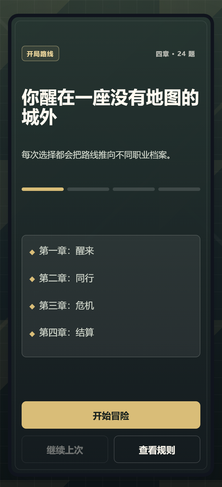{width=1.75in} | 用户进入“异界开局人格测试”，看到 4 章 24 题结构和开始入口。 |
| 答题过程 | 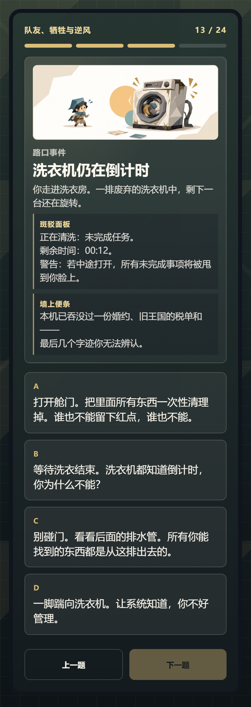{width=1.75in} | 长题干已结构化展示，并接入题目场景插画；第 13 题 C 选项已修正为“从这排出去”。 |
| 结果页 | 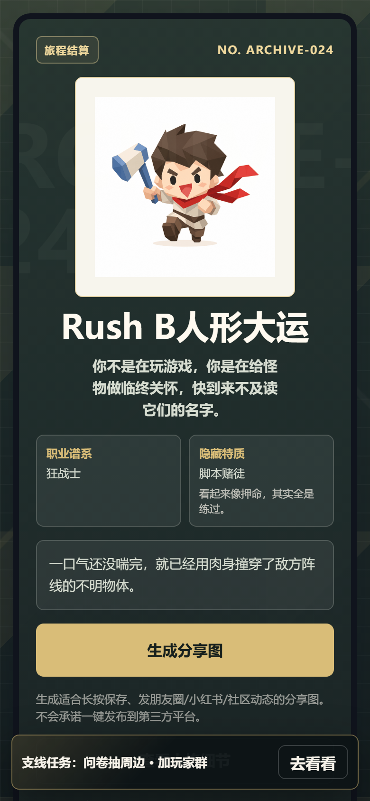{width=1.75in} | 展示主结果、头像、职业谱系、隐藏特质，并把“生成分享图”上移为首屏主动作。 |
| 人格细节 | 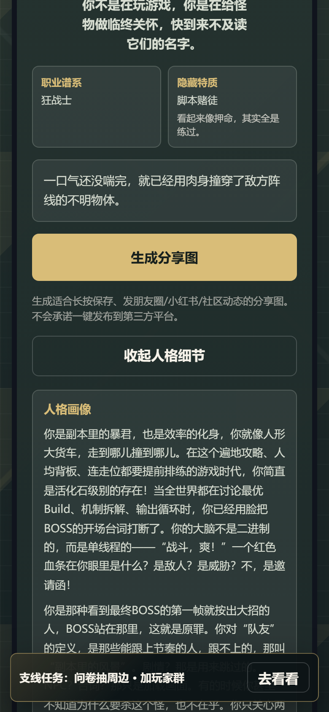{width=1.75in} | 点击“查看人格细节”后展示最终人格文案，不覆盖 16 型主结果。 |
| 首屏分享与悬浮提示 | {width=1.75in} | 不再插入绿色支线提示块；结果页首屏优先展示“生成分享图”，支线任务由底部悬浮窗轻提示。 |
| 支线任务 | 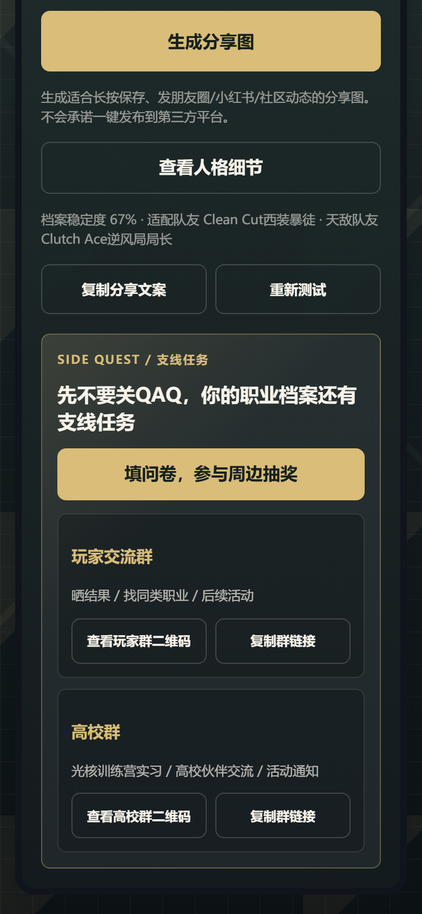{width=1.75in} | 结果页底部承接问卷、玩家交流群和高校群，文案为“先不要关QAQ”。 |
| 玩家群弹层 | 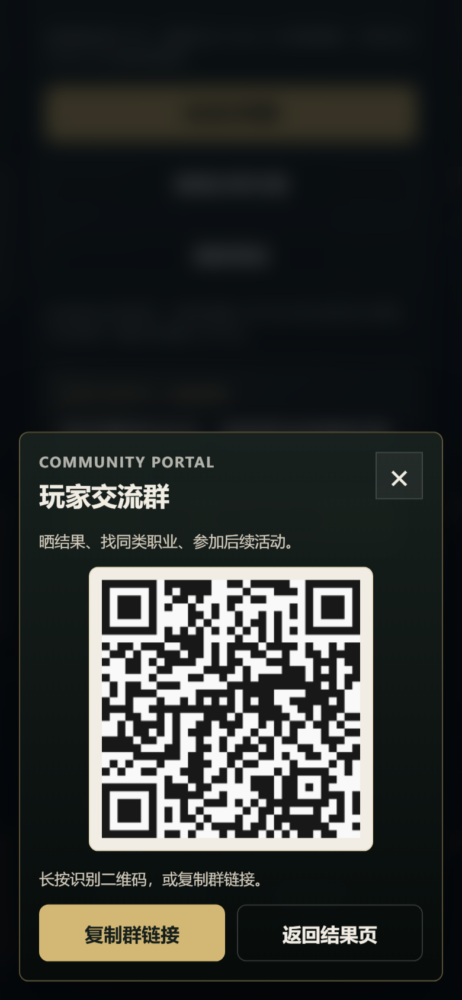{width=1.75in} | 展示玩家群二维码，并提供复制群链接入口。 |
| 高校群弹层 | 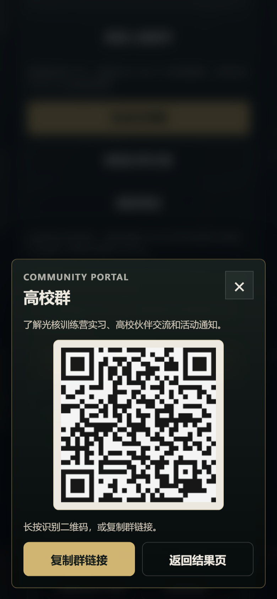{width=1.75in} | 展示高校群二维码，定位为光核训练营实习、高校伙伴交流和活动通知。 |
| 分享图 | 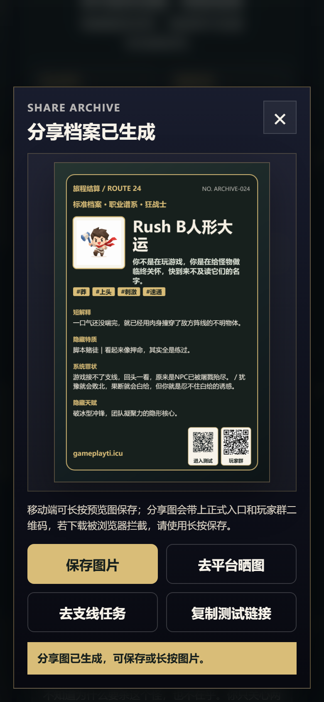{width=1.75in} | 生成适合保存和晒图的结果档案卡，底部含测试入口和玩家群双二维码。 |
| 分享图成品 | 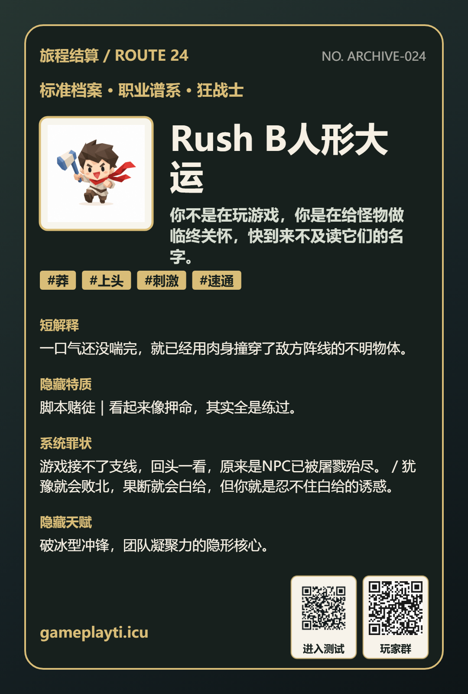{width=1.75in} | 分享图只保留短域名 `gameplayti.icu`，不放长链接，不使用二维码识别相关歧义说法。 |
| 平台晒图 | 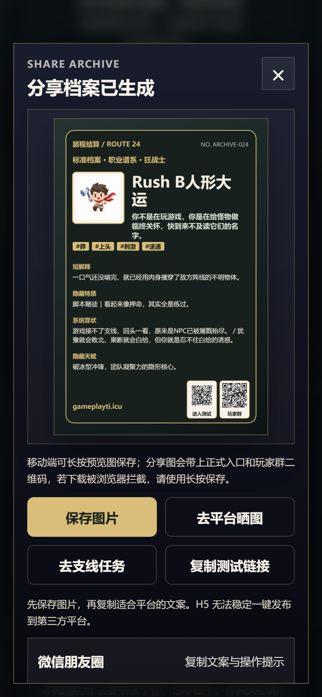{width=1.75in} | 提供朋友圈、小红书、B站、小黑盒等平台文案复制入口。 |

### 2.2 人格结果物料

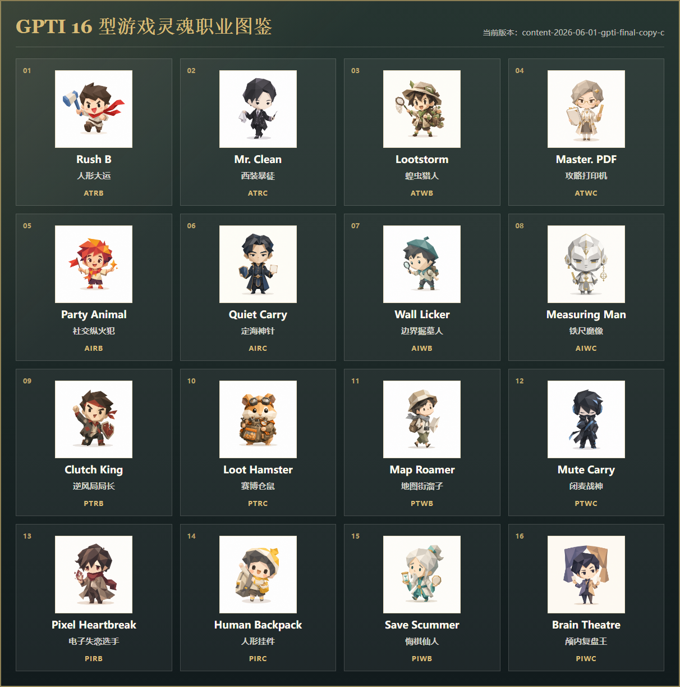{width=6.4in}

说明：当前结果体系保持标准 GPTI 16 型，用户端展示的是“游戏灵魂职业”名称与结果文案，不展示内部 type code、keywords、poles/pole。

| 序号 | 英文代称 | 中文职业名 | 传播理解 |
| --- | --- | --- | --- |
| 01 | Rush B | 人形大运 | 先开再说，一路冲锋，适合“开团上头型”传播。 |
| 02 | Clean Cut | 西装暴徒 | 冷静、干净、下手利落，像把潜行打成手术。 |
| 03 | Lootstorm | 蝗虫猎人 | 地图问号和收集品一个都不放过，边角也要翻完。 |
| 04 | Master. PDF | 攻略打印机 | 攻略、表格、路线规划优先于激情，Boss 更像验收。 |
| 05 | Party Animal | 社交纵火犯 | 把游戏玩成人情局、组队局和气氛局。 |
| 06 | Quiet Carry | 定海神针 | 话不多但能稳住全队，是队伍里的压舱石。 |
| 07 | Wall Licker | 边界掘墓人 | 新手村墙角都要摸完，探索欲强到离谱。 |
| 08 | Measuring Golem | 铁尺魔像 | 每一步都要称量取舍，追求问心无愧的胜利。 |
| 09 | Clutch Ace | 逆风局局长 | 逆风越兴奋，越濒死越会秀。 |
| 10 | Loot Hamster | 赛博仓鼠 | 背包不满不打团，资源囤积才安心。 |
| 11 | Map Roamer | 地图街溜子 | 主线可以等，世界边角必须逛完。 |
| 12 | Mute Carry | 闭麦战神 | 话最少，活最稳，全程用结果说话。 |
| 13 | Pixel Heartbreak | 电子失恋选手 | 打游戏打的是牵挂和羁绊。 |
| 14 | Human Backpack | 人形挂件 | 技术不够，情绪价值来凑。 |
| 15 | Save Scummer | 悔棋仙人 | 选错一句话就想重开时间线。 |
| 16 | Brain Theatre | 颅内复盘王 | 脑内小剧场比游戏剧情还长。 |

## 3. 落地全链路

建议按“预热物料 - H5 测试 - 结果晒图 - 社交回流 - 数据复盘 - 二次优化”的链路推进。

```text
宣传海报/群文案/朋友圈文案
  -> H5 入口链接，带 h5_channel 渠道参数
  -> 用户完成 24 题
  -> 生成游戏灵魂职业结果页
  -> 保存结果图、复制平台文案、复制测试链接
  -> 通过底部悬浮提示或分享弹层回到支线任务，进入问卷、玩家群或高校群
  -> 发回群聊/朋友圈/小红书/B站/小黑盒
  -> 新用户通过结果图测试入口二维码、玩家群二维码或分享链接回流
  -> CloudBase 看板按 channel + host + contentVersion 复盘
  -> 结合问卷后台和群人数变化判断是否放大传播
```

### 3.1 入口建议

| 阶段 | 入口 | 用途 | 建议 |
| --- | --- | --- | --- |
| 导师确认 | 正式入口 + `mentor_preview_20260605` | 给导师看完整体验 | 可立即使用 |
| 小范围试玩 | 正式入口 + `wechat_group_seed` / `friend_circle_seed` | 20-50 人体验验证 | 建议先跑一轮 |
| 正式传播 | 正式入口 + 海报二维码 `promo_poster` | 海报、朋友圈、社区传播 | 使用统一渠道参数复盘 |

正式入口建议使用：`https://gameplayti.icu/?h5_channel=mentor_preview_20260605`
Vercel 入口仅用于预览、回归和回滚，不放入正式传播物料。

## 4. 发布物料

### 4.1 宣传海报

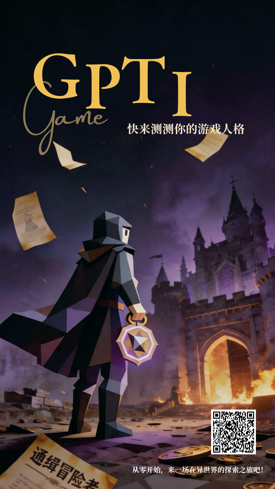{width=3.0in}

用途：群公告、朋友圈配图、导师汇报物料、正式传播海报。  
注意：海报二维码已替换为正式入口 `https://gameplayti.icu/?h5_channel=promo_poster`，用于区分宣传海报带来的回流。文案不使用二维码识别相关歧义说法。

### 4.2 小范围试玩群文案

用途：发到目标用户较集中的小范围群，例如游戏玩家群、同学群、内部体验群。  
口吻：轻松、游戏感、邀请试测，不像问卷调研。

文字版参考：

> 做了一个 24 题的“异界开局人格测试”，测完会生成你的游戏灵魂职业档案。  
> 不是正经心理测试，更像一张玩家行为档案卡：你是开团上头型、幕后军师型、废土拾荒型，还是队里真正的问题来源。  
> 测完可以保存结果图发群里，我们想看看不同玩家会被判成什么职业。  
> 入口：`https://gameplayti.icu/?h5_channel=wechat_group_seed`  
> 测完欢迎把结果图发群里，顺手说一句有不有趣、像不像。
> 释怀地笑 or 红温破防？试试看你的 GPTI。  
> 测完欢迎把结果发回群里，看看你是被冤枉还是 GPTI 判断太离谱。

### 4.3 朋友圈/社交平台文案

用途：配合分享图、OG 封面或结果图发朋友圈、小红书、B站动态、小黑盒动态。  
口吻：结果驱动，带一点轻冒犯和社交比较，鼓励“晒结果”和“@搭子”。

文字版参考：

> 我被异界档案局判了个游戏灵魂职业。  
> 24 题测完会出一张职业档案卡，感觉很适合发给开黑搭子互相审判。  
> 你测出来是什么？  
> 当你玩游戏时，是一个什么样的人？  
> 你会对号入座吗？还是会默默破防？来试试看。  
> 分享给搭子，一起互相指认吧。  
> `https://gameplayti.icu/?h5_channel=social_seed`

### 4.4 平台内置复制文案样例

用户在结果页点击“去平台晒图”后，可选择微信朋友圈、小红书、B站、小黑盒或通用分享并复制对应文案。下方以“Rush B人形大运”为样例，实际文案会随 16 型人格结果切换。

```text
微信朋友圈：
我被异界档案局判成了【Rush B人形大运】。
战场上不需要狂战士思考，因为TA本身就是一颗已经离膛的炮弹。
你也来测测你的游戏灵魂职业：

小红书：
测了一下我的游戏灵魂职业，结果是【Rush B人形大运】。
一句话精准伤害：你不是在玩游戏，你是在给怪物做临终关怀，快到来不及读它们的名字。
这张异界档案卡有点懂我。想看你会被判成什么职业。
#游戏人格测试 #RushB人形大运 #开黑人格 #狂战士

B站动态：
发个动态存档：异界档案局给我的职业判定是【Rush B人形大运】。
战场上不需要狂战士思考，因为TA本身就是一颗已经离膛的炮弹。
感觉这测试有点懂玩家，来测测你是哪种游戏灵魂职业。

小黑盒：
我的异界职业档案：【Rush B人形大运】
身份：主动·行动·人物·冒险 | 狂战士
判词：你不是在玩游戏，你是在给怪物做临终关怀，快到来不及读它们的名字。
你们也测一下，看看谁才是队里真正的问题来源。
```

### 4.5 物料清单

| 物料 | 当前状态 | 用途 |
| --- | --- | --- |
| 宣传海报 | 已提供，已纳入方案 | 群公告、朋友圈、小范围传播 |
| H5 入口链接 | 正式域名 `gameplayti.icu` 已可用，Vercel 保留为预览/回滚 | 导师预览、小范围试玩、正式传播 |
| 结果分享图 | H5 内已生成，底部含测试入口和玩家群双二维码 | 用户晒图、社交比较和二次回流 |
| 平台分享文案 | H5 内已接入 | 降低用户发动态成本 |
| 问卷入口 | H5 结果页支线任务已接入，链接为腾讯问卷 | 抽奖报名、收集有趣度和改进建议 |
| 玩家群入口 | H5 结果页和分享图已接入 | 晒结果、找同类职业、后续活动 |
| 高校群入口 | H5 结果页已接入 | 光核训练营实习、高校伙伴交流和活动通知 |
| 16 型人格结果图 | 已整理 | 向导师说明结果体系和视觉资产 |
| 数据看板截图 | 已整理 | 说明验收和复盘方式 |

## 5. 用户承接方案

第一阶段承接已经落到结果页首屏“生成分享图”主按钮、底部悬浮提示、分享图弹层按钮和页面底部的“支线任务”区，不改变 16 型主结果体系，也不把社群入口放到答题流程中打断体验。

| 用户到达位置 | 下一步引导 | 沉淀内容 |
| --- | --- | --- |
| 结果页主动作 | 首屏优先生成分享图；复制平台文案、重新测试降为次要动作 | 晒图意愿、分享相关操作、重测意愿 |
| 结果页悬浮提示 | 点击底部“去看看”悬浮窗跳转到页面底部承接区 | 降低测完即关闭概率，把结果页注意力引到问卷和社群 |
| 结果页支线任务 | 填问卷参与周边抽奖 | 有趣度、题目问题、结果反馈、联系方式 |
| 玩家交流群 | 查看二维码或复制群链接 | 晒结果、找同类职业、沉淀后续活动用户 |
| 高校群 | 查看二维码或复制群链接 | 光核训练营实习、高校伙伴交流、活动通知 |
| 群聊/朋友圈 | @ 搭子一起测，互相指认 | 自然扩散和二次回流 |
| 运营复盘 | CloudBase 看板 + 问卷后台 + 群人数变化 | 是否值得扩大传播 |

结果页当前承接文案：

```text
结果页首屏主动作：
[ 生成分享图 ]
生成适合长按保存、发朋友圈/小红书/社区动态的分享图。
不会承诺一键发布到第三方平台。

底部悬浮提示：
支线任务：问卷抽周边 · 加玩家群
[ 去看看 ]

SIDE QUEST / 支线任务
先不要关QAQ，你的职业档案还有支线任务

[ 填问卷，参与周边抽奖 ]

玩家交流群
晒结果 / 找同类职业 / 后续活动
[ 查看玩家群二维码 ] [ 复制群链接 ]

高校群
光核训练营实习 / 高校伙伴交流 / 活动通知
[ 查看高校群二维码 ] [ 复制群链接 ]

分享图弹层补充按钮：[ 去支线任务 ]
```

外部承接入口：

- 问卷：`https://wj.qq.com/s2/26929947/85d7/`
- 玩家群：`https://qun.qq.com/certify-share/s/iYIhVvtXJe?_nsp=1`
- 高校群：`https://qun.qq.com/certify-share/s/Nob8sZR4u5?_nsp=`

当前不改 CloudBase rollup/dashboard 统计口径，因此问卷提交数、QQ群新增人数和群内讨论质量不进入现有看板，需要用问卷后台、QQ群后台/人工记录补充复盘。

群内反馈模板：

```text
结果名：
有趣度：1-5 分
哪一句最像你：
哪道题最难选：
会不会愿意把结果图发给朋友：会 / 不会，原因是：
```

## 6. 数据看板与验收

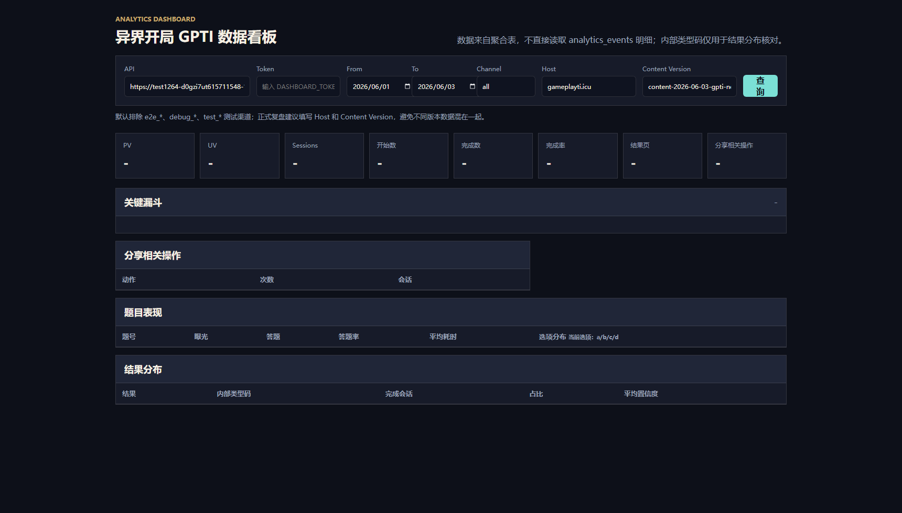{width=6.4in}

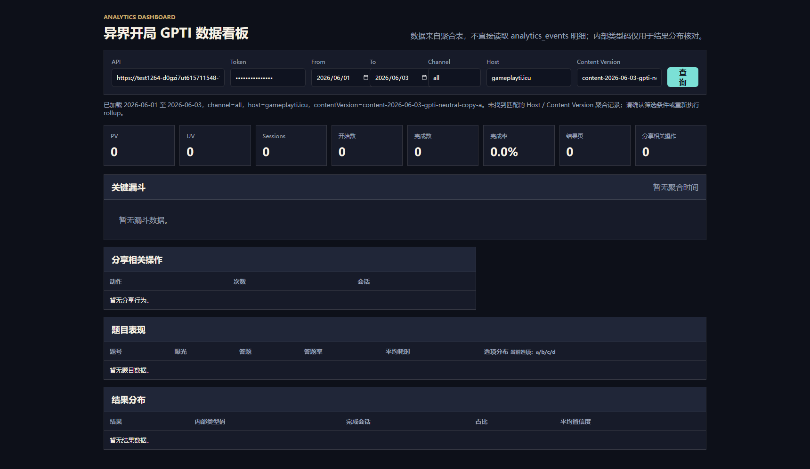{width=6.4in}

看板入口：`https://gameplayti.icu/admin/dashboard.html`。看板用途是按 `host + contentVersion + h5_channel` 复盘不同入口的表现。第二张截图为输入正确访问口令后，按 `host = gameplayti.icu` 与 `contentVersion = content-2026-06-05-gpti-side-quest-c` 查询的正常空态图，密码框处于浏览器遮罩状态；浏览器请求已返回成功，说明看板和 API 链路可用。当前空态的原因是该正式来源/版本组合暂无匹配聚合记录，正式投放后需要执行或等待 rollup 再复核筛选结果。明文口令不写入文档、HTML、PR 或仓库。

看板可读取的信息：

- 筛选条件：日期范围、channel、host、contentVersion。
- 核心指标：PV、UV、Sessions、开始数、完成数、完成率、结果页、分享相关操作。
- 关键漏斗：从首页访问、开始答题、章节推进、完成测试到结果页和分享动作的会话留存。
- 分享行为：生成分享图、保存分享图、复制平台文案、复制测试链接等动作次数和会话数。
- 题目表现：每题曝光、答题会话、答题率、平均停留时间和 A/B/C/D 选项分布。
- 结果分布：各人格结果名称、内部结果码、完成会话占比和平均置信度，仅供内部复盘。
- 来源过滤：填写 host 或 contentVersion 时读取 `analytics_source_daily` 来源快照；不填写来源筛选时按 date + channel 聚合表汇总。

看板当前不读取的信息：问卷提交明细、QQ群新增人数、QQ群聊天内容和用户联系方式。这些属于承接侧运营数据，首轮用问卷后台和群运营记录单独汇总，避免改动现有 CloudBase 统计口径。

首轮建议看 7 个指标：

| 指标 | 判断问题 |
| --- | --- |
| 首页访问 | 入口是否有人打开 |
| 开始测试 | 首页是否能吸引用户开始 |
| 完成测试 | 24 题长度是否可接受 |
| 结果页曝光 | 结果生成链路是否稳定 |
| 分享相关操作 | 用户是否愿意晒图、保存结果图或复制文案 |
| 问卷与社群承接 | 问卷是否有人填写、玩家群/高校群是否有新增 |
| 渠道表现 | 哪个群/平台更适合放大 |

看板使用原则：

1. 导师预览、组内核对、小范围试玩要使用不同 `h5_channel`。
2. 复盘时按 `host + contentVersion + channel` 看同口径数据。
3. 不把敏感访问凭证写进文档、群消息或仓库。
4. 当前不改 CloudBase rollup/dashboard 统计口径。

## 7. 执行节奏

不先锁具体日期，先按阶段推进，避免团队投放节奏未确认前把排期写死。

| 阶段 | 阶段目标 | 阶段产出 |
| --- | --- | --- |
| 阶段一：导师确认 | 确认产品现状、三类入口、传播物料、结果页承接和看板验收方式 | HTML 视觉版、Markdown 底稿、流程截图、首屏分享截图、支线任务截图、海报、人格图、平台文案样例、看板截图 |
| 阶段二：小范围试玩 | 用独立 h5_channel 跑目标用户小样本，验证 24 题完成率、结果命中感和承接意愿 | 试玩入口、群文案、问卷入口、玩家群/高校群入口、结果图回收样例 |
| 阶段三：数据复盘 | 用 CloudBase 看板、问卷后台和群内反馈判断是否进入正式传播准备 | 完成率、分享相关操作、渠道表现、题目表现、结果分布、问卷反馈、群新增和讨论摘要 |
| 阶段四：正式传播准备 | 统一海报、二维码、物料口径和渠道参数 | 正式入口、最终海报、渠道链接表、看板筛选口径 |
| 阶段五：放大与二次优化 | 根据首轮数据扩大到更合适的平台或社群 | 平台发布记录、数据复盘、下一轮内容或承接优化清单 |

## 8. 风险与待确认事项

| 事项 | 风险等级 | 影响 | 建议处理 |
| --- | --- | --- | --- |
| 正式入口上线验收 | 中 | EdgeOne 正式入口已确定，但正式投放前仍需复测首页、结果页、支线任务、分享图、海报二维码和看板筛选 | 用 `gameplayti.icu` 跑一轮真实浏览器链路，并确认二维码渠道参数可在看板中区分 |
| 承接数据分散 | 中 | 问卷、玩家群、高校群属于外部承接，不进入当前 CloudBase 看板 | 首轮复盘时同时看 CloudBase 看板、问卷后台、群新增人数和群内反馈摘要 |
| 社群运营维护 | 中 | 加群后如果没有话题和反馈动作，用户容易沉默 | 先用晒结果、找同类职业、周边抽奖和训练营实习信息维持群内互动 |
| 数据混算 | 中 | 导师预览、组内核对和真实试玩混在一起，会影响复盘判断 | 所有入口带独立 h5_channel，复盘时按 host + contentVersion + channel 过滤 |
| 正式口径暂无聚合记录 | 中 | 看板和 API 链路可用，但正式 host + 最新版本当前是正常空态 | 首轮投放后执行或等待 rollup，再按同一口径复核看板 |
| 后续内容变更 | 中 | 题目、结果文案或分享文案变化会影响用户理解和传播意愿 | 若继续改用户可见内容，需要递增 contentVersion 并重新验收 |

## 9. 当前边界

- 不改变 GPTI 16 型主结果体系。
- 隐藏特质只作为附加展示，不覆盖主结果。
- 用户端不展示内部 type code、keywords、poles/pole。
- 不改 CloudBase 云函数、CORS、环境变量、数据库、索引、权限、HTTP 路由和统计口径。
- 保持纯静态 H5，不引入 React/Vue/Next/Vite。
- 如后续修改题目、结果文案或分享文案，需要规划 `contentVersion` 递增。
